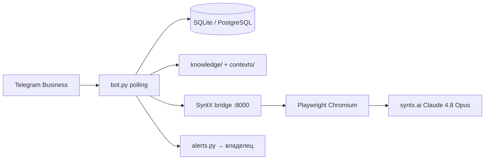

# Telegram Business Neuroagent

Личный нейроагент для Telegram Business: получает сообщения из выбранных
личных чатов владельца, ведёт изолированную память по каждому собеседнику,
готовит ответ в стиле владельца через **SyntX (Claude 4.8 Opus)** и отвечает
от его имени только в безопасных сценариях. Сомнительные и критические случаи
передаются владельцу с кнопками подтверждения.

## Архитектура



| Компонент | Назначение |
| --- | --- |
| `bot.py` | Telegram Business, очереди, эскалации, handoff владельцу |
| `integrations/syntx/bridge.py` | Локальный HTTP-мост к SyntX через браузер |
| `knowledge/` | Редактируемые шаблоны личности, стиля, правил (RU) |
| `contexts/` | Прежние контекстные файлы (совместимость) |
| `author.py` | Классификация автора сообщения |
| `alerts.py` | Уведомления владельцу, повторы критических алертов |
| `memory.py` / `store.py` | Память диалогов и ротация чатов SyntX |
| `deploy/` | Ubuntu VPS, systemd, первый логин SyntX |

### Изоляция и handoff

- Каждый диалог обрабатывается с отдельным контекстом; чат SyntX ротируется
  по `SYNTX_CHAT_ROTATION_HOURS` / `SYNTX_CHAT_MAX_MESSAGES`.
- Автоответы выключены по умолчанию (`AUTO_REPLY_ENABLED=false`).
- Маркеры `[TODO:` в `knowledge/` и `contexts/` блокируют автоответы до заполнения.
- Владелец получает алерт с кнопками **Принял** (`ack:`) и **Вернуть ИИ**
  (`resume_ai:`); критические алерты могут повторяться до подтверждения.
- Сообщения от бота, владельца, контакта и offline-автоответов различаются
  через `author.classify_message_author`.

### Где должен работать процесс

Для **24/7** нужен постоянный **VPS** (см. `deploy/README.md`). GitHub Actions,
бесплатные PaaS и Cursor Cloud **не являются** надёжным always-on хостингом для
polling-бота и headful/headless Chromium. Телефон в беззвучном режиме программно
**не обходится** — критические уведомления идут только через настроенные каналы.

## Что уже есть в репозитории vs что проверить

**Реализовано в коде (требует вашей настройки):**

- Telegram Business polling и сохранение сообщений;
- локальный SyntX bridge (FastAPI + Playwright);
- шаблоны знаний, алерты, классификация автора, заготовка импорта экспорта.

**Ещё не верифицировано end-to-end на production:**

- стабильная сессия SyntX в headless после первого headed-логина;
- полный цикл «контакт → Claude 4.8 Opus → автоответ» на вашем VPS;
- SMS/push-каналы (заглушки; без ключей работает только Telegram);
- импорт старых чатов из Telegram Desktop — только stub, тестируйте на копии БД.

Telegram не отдаёт всю старую переписку задним числом. История накапливается
после подключения; факты можно внести в `knowledge/` или импортировать экспорт
через `import_telegram_export.py`.

## Безопасное поведение (fail closed)

1. Автоответы выключены по умолчанию.
2. Незаполненные шаблоны с `[TODO:` блокируют автоответы.
3. Новый контакт не получает автоответы до `/allow <chat_id>`.
4. Деньги, встречи, обещания, конфликты, здоровье, документы — эскалация владельцу.
5. Низкая уверенность, ошибка модели или SyntX → эскалация, не случайный ответ.
6. Обработка каждого чата сериализована.

Содержимое переписки попадает в SyntX/браузер на вашем сервере. Оцените
приватность до включения автоответов.

## Подготовка

- Python 3.11+
- Telegram Premium + Telegram Business
- Токен бота от [@BotFather](https://t.me/BotFather)
- VPS с Ubuntu для production (рекомендуется)
- Аккаунт [syntx.ai](https://syntx.ai) и ручной первый вход в браузер

Скопируйте `env.example` в `.env`. Поддерживаются имена `TELEGRAM_BOT_TOKEN` /
`BOT_TOKEN` и `OWNER_TELEGRAM_ID` / `OWNER_ID`. Не коммитьте `.env`.

## Локальный запуск (разработка)

```bash
python3 -m venv .venv
source .venv/bin/activate   # Windows: .venv\Scripts\activate
pip install -r requirements.txt
pip install -r integrations/syntx/requirements-syntx.txt
playwright install chromium

# Терминал 1 — bridge (первый раз SYNTX_HEADLESS=false для логина)
python -m integrations.syntx.bridge

# Терминал 2 — бот
python bot.py
```

Health bridge: `curl http://127.0.0.1:8000/health`

## Настройка знаний

Заполните `knowledge/`:

- `identity.md`, `personal_facts.md`, `communication_style.md`
- `response_rules.md`, `forbidden_topics.md`, `escalation_rules.md`
- `knowledge/examples/` — реальные фрагменты ваших ответов

Совместимость: `contexts/owner.md`, `contexts/style.md`, `contexts/rules.md`.

## Подключение Telegram Business

1. Нажмите **Start** у бота.
2. В BotFather включите Business Mode.
3. **Настройки → Telegram Business → Чат-боты** — подключите бота и чаты.
4. Проверьте `/status`.

## Включение автоответов

1. Тестируйте с `AUTO_REPLY_ENABLED=false`.
2. Заполните `knowledge/`, проверьте алерты.
3. Убедитесь, что `curl http://127.0.0.1:8000/health` → `ok: true`.
4. `AUTO_REPLY_ENABLED=true`, `/allow <chat_id>`, `/resume`.

## Развёртывание

- **Production VPS:** `deploy/install.sh`, `deploy/README.md`
- **Render (legacy):** один экземпляр polling; SyntX bridge на Render **не**
  подходит без отдельного VPS для Playwright

## Проверка

```bash
python -m unittest discover -s tests -v
python -m compileall -q .
```

## Переменные окружения

См. `env.example`. Основные:

| Переменная | Описание |
| --- | --- |
| `TELEGRAM_BOT_TOKEN` / `BOT_TOKEN` | токен бота |
| `OWNER_TELEGRAM_ID` / `OWNER_ID` | Telegram ID владельца |
| `SYNTX_BRIDGE_URL` | URL моста, по умолчанию `http://127.0.0.1:8000/syntx_chat` |
| `DATABASE_URL` | `sqlite:///data/bot.db` или PostgreSQL DSN |
| `MEMORY_RETENTION_DAYS` | срок хранения памяти |
| `RECENT_MESSAGE_LIMIT` | окно последних сообщений в промпте |
| `SYNTX_CHAT_ROTATION_HOURS` | ротация чата SyntX |
| `CONFIDENCE_THRESHOLD` | минимальная уверенность для автоответа |
| `AUTO_REPLY_ENABLED` | глобальный предохранитель |
| `ALERT_CHANNELS` | `telegram`, опционально `sms`, `push` |
